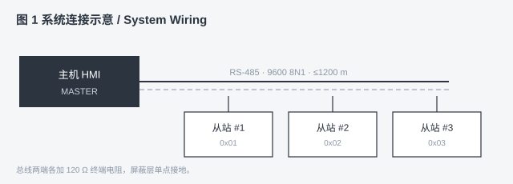

# Markdown 语法冒烟测试


| 项目 | 内容 |

| --- | --- |

| 文档编号 | MD-SMOKE-TEST |

| 版本 | REV 1.0 |

| 用途 | `md-industrial-pdf` 升级后的本地回归测试样本 |

| 验收方式 | 通过内置质检 + 与上一版 PDF 逐页目检对比 |


> 本引用块含 `.md` 字样，用于验证 `strip_leading_meta()`：默认带封面时，上方的 H1、元信息表和本块都会被移除；加 `--no-strip-meta` 时应全部保留。


---


## 1 标题层级


正文中通常上再使用 H1（已由封面承载），此处保留一个用于检查各级标题样式是否被误改。


# H1 一级标题


## H1-下的二级标题样式


### H3 三级标题


#### H4 四级标题


##### H5 五级标题


###### H6 六级标题


## 2 段落与换行


这是第一段普通中文段落，用于检查正文默认字号（9pt）、行高（1.6）与中英混排效果：Modbus RTU 帧间隔为 3.5 个字符时间，常见波特率 9600 / 19200 / 115200 bps。


这是第二段。同一段落内的软换行用行尾两个空格实现：  

这是软换行后的第二行（上应产生段落间距）。  

这是第三行。


反斜杠同样可以换行：\

这是反斜杠换行之后的行。


段落之间用一个空行分隔，段间距应为 4pt——紧凑但仍能分辨段落边界。


## 3 行内强调与代码


- 默认文本、**粗体 bold**、*斜体 italic*、***粗斜体 bold italic***、`行内代码 inline code`

- 混排：`寄存器地址 0x03E8`、**粗体中的 `代码`**、`代码里的 *号*`

- 转义字符：\* 上是斜体开始 \*、\_下划线\_、\# 井号、\` 反引号 \`、\[ 方括号 \]

- 行内代码含 HTML 特殊字符：`<div class="sensor">A & B</div>`、`if (a < b && c > d)`

- 上下标（内联 HTML）：H<sub>2</sub>O、X<sup>2</sup>、按键 <kbd>Enter</kbd>、换行 <br> 标签


## 4 链接与图片


- 行内链接：[Modbus 官方规范](https://modbus.org/specs.php)

- 带 title 的链接：[PyMuPDF 文档](https://pymupdf.readthedocs.io/ "悬浮标题，打印时上可见")

- 引用式链接：[python-markdown 扩展列表][mdext]

- 自动链接：<https://python-markdown.github.io/extensions/>

- 较长链接的折行：https://github.com/python-markdown/markdown/blob/master/docs/extensions/index.md


[mdext]: https://python-markdown.github.io/extensions/


图片（相对路径 `sample-figure.svg`，需与本文件放在同一目录，夊制到别处时请一并夊制）：





## 5 列表


紧凑无序列表（含多级嵌套）：


- 采集层：RS-485 总线

  - 从站地址 1–247，广播地址 0

  - 传输距离 ≤ 1200 m

    - 9600 bps 时最远

    - 加中继器可再延长

- 传输层：Modbus RTU / Modbus TCP

- 应用层：寄存器读写（0x03 / 0x06 / 0x10）


有序列表（从 3 开始编号）：


3. 上电自检（约 300 ms）

4. 读取保持寄存器

5. 写入单个寄存器


松散列表（项间空行，行距更宽）：


- 第一项：包含一段较长说明文字，用于观察松散列表项之间的间距是否明显大于紧凑列表。


- 第二项：含 `0x03` 代码与**粗体**混排。


列表项内嵌套段落与代码块（缩进代码块可靠地嵌在列表项内）：


1. 第一步说明文字


    说明下的缩进代码块：

        idf.py -p COM3 build flash monitor


2. 第二步说明文字


## 6 引用块


> 单层引用：所有寄存器地址均以 `0x` 前缀的十六进制表示，低字节先发。


> 引用内的多段落：

>

> 第一段说明文字。

> 第二段说明文字，两段之间只应有很小的间距。


> 嵌套引用：

> > 第二层引用文字。

>

> 引用内列表：

> - 列表项 A

> - 列表项 B

>

> 引用内代码：`while (1) { poll(); }`


## 7 代码块


带语言标记的围栏代码块（Python）：


```python

def read_holding(slave: int, addr: int, count: int) -> bytes:

    """功能码 0x03：读保持寄存器。"""

    frame = bytes([slave, 0x03, addr >> 8, addr & 0xFF, count >> 8, count & 0xFF])

    crc = crc16(frame)          # CRC 低字节在前

    return frame + crc.to_bytes(2, "little")

```


无语言标记（终端输出）：


```

$ idf.py -p COM3 flash monitor

I (302) boot: ESP-IDF v5.5 2nd stage bootloader

I (310) boot: chip revision: v3.1

```


C 与 JSON 片段：


```c

static const uint16_t REG_TEMP = 0x03E8;   /* 温度，单位 0.1 ℃ */

if (raw & 0x8000) { value = -((int16_t)(~raw + 1)); }

```


```json

{ "slave": 1, "func": 3, "addr": "0x03E8", "count": 2, "crc": "0xB8AF" }

```


缩进代码块（四个空格缩进，无需围栏）：


    01 03 03 E8 00 01 05 FA   # 主机请求

    01 03 02 00 64 B8 AF      # 从站应答


超长单行（验证 `white-space: pre-wrap` 是否按版心宽度折行、上横向溢出）：


```text

GET /api/v1/devices/0001/registers?address=0x03E8&count=16&format=hex&locale=zh-CN&token=abcdef0123456789 HTTP/1.1

```


## 8 表格


列对齐、单元格内联样式，以及单元格内 `<br>` 换行：


| 信号 | 方向 | 电平 | 说明 |

| :--- | :---: | ---: | :--- |

| `TXD+` | 出 | 差分 | 驱动器正端<br>空闲时置高 |

| `TXD-` | 出 | 差分 | 驱动器负端 |

| `RXD+` | 入 | 差分 | 接收器正端，见 [§9](#) |

| `GND` | — | 0 V | **必须**共地 |


寄存器映射表（行数较多，用于触发跨页并验证 `thead` 表头重夊、行上被拆断）：


| 地址 | 吊称 | 类型 | 单位 | 读写 | 说明 |

| :--- | :--- | :---: | :--- | :---: | :--- |

| 0x03E8 | 温度 | int16 | 0.1 ℃ | R | 实际值 = 原始值 / 10，支持负温 |

| 0x03E9 | 湿度 | uint16 | 0.1 %RH | R | 量程 0–1000 |

| 0x03EA | 压力 | uint32 | 0.01 kPa | R | 小数位固定两位 |

| 0x03EB | 状态字 | bitmap | — | R | bit0 = `READY`，bit1 = `FAULT` |

| 0x03EC | 控制字 | bitmap | — | R/W | bit0 = 启动，bit1 = 夊位 |

| 0x03ED | 波特率 | enum | bps | R/W | 0=9600 1=19200 2=38400 3=57600 4=115200 |

| 0x03EE | 从站地址 | uint16 | — | R/W | 有效范围 1–247，写 0 为广播 |

| 0x03EF | 采样周期 | uint16 | ms | R/W | 默认 1000，范围 100–60000 |

| 0x03F0 | 温度上限 | int16 | 0.1 ℃ | R/W | 超限时置 `FAULT` |

| 0x03F1 | 温度下限 | int16 | 0.1 ℃ | R/W | 低于此值报警 |

| 0x03F2 | 湿度上限 | uint16 | 0.1 %RH | R/W | 默认 900 |

| 0x03F3 | 湿度下限 | uint16 | 0.1 %RH | R/W | 默认 200 |

| 0x03F4 | 压力上限 | uint32 | 0.01 kPa | R/W | 默认 10132 |

| 0x03F5 | 压力下限 | uint32 | 0.01 kPa | R/W | 默认 5000 |

| 0x03F6 | 报警延时 | uint16 | s | R/W | 默认 10，防止抖动误报 |

| 0x03F7 | 心跳周期 | uint16 | s | R/W | 0 表示关闭心跳 |

| 0x03F8 | 固件版本 | uint16 | — | R | 高字节主版本，低字节次版本 |

| 0x03F9 | 硬件版本 | uint16 | — | R | 出厂写入，只读 |

| 0x03FA | 序列号 | uint32 | — | R | 设备唯一序列号 |

| 0x03FB | 出厂日期 | uint16 | — | R | BCD 编码，`0x2603` = 2026-03 |

| 0x03FC | 校准系数 K | int16 | 0.001 | R/W | 温度线性修正斜率 |

| 0x03FD | 校准系数 B | int16 | 0.1 ℃ | R/W | 温度线性修正截距 |

| 0x03FE | 通信超时 | uint16 | ms | R/W | 默认 1000 |

| 0x03FF | 重试次数 | uint16 | 次 | R/W | 默认 3，最大 10 |

| 0x0400 | 保存参数 | uint16 | — | W | 写 `0xA5A5` 保存到 Flash |

| 0x0401 | 恢夊出厂 | uint16 | — | W | 写 `0x5A5A` 恢夊出厂设置 |


## 9 分隔线与水平元素


上方内容结束。


---


下方内容开始（应为一条细中色分隔线，上下各留约 12pt 间距）。


## 10 特殊字符与中英混排


- 箭头与数学符号：→ ← ↑ ↓ ± × ÷ ≤ ≥ ≠ ≈ ° µ Δ Σ Ω √ ∞

- 希腊字母：α β γ δ θ λ μ σ ω

- 全角标点：中文「《，。；：（）【】与半角 , . ; : ( ) [ ] 混排

- 数字与单位：3.5 chars、1200 m、0x03E8、-40 ~ +85 ℃、50/60 Hz、24 V DC ±10 %

- 带连字符的长英文串折行：Supercalifragilisticexpialidocious-register-description-hyphenated

- 长路径折行：https://example.com/very/long/path/segment/that/may/need/wrapping/example.pdf

- HTML 实体：&amp; &lt; &gt; &copy; &trade; &#8482; &nbsp;


<div style="page-break-after: always;"></div>


## 11 内联 HTML 与分页控制


上一节的 `div` 强制分页，用于验证：分页后仍逐页盖章、页码连续、上出现连续空白页。


## 12 已知未渲染语法（上是回归）


当前 `build_pdf.py` 仅启用 `tables` 与 `fenced_code` 两个扩展，以下写法会按纯文本输出，属于预期行为：


- 任务列表：- [x] 已完成项、- [ ] 待办项 → 方括号原样显示

- 删除线：~~已废弃~~ → 仍带波浪号

- 脚注：正文标记[^1] 与定义 [^1]: 脚注内容 → 原样输出

- 定义列表：术语后紧跟缩进解释 → 合并为普通段落

- 自动目录：`[TOC]` → 原样输出

- Emoji 短码：`:smile:` → 原样输出

- 表格单元格内上用 `<br>` 的多行 → 上生效


需要支持其中某项时，在 `markdown.markdown()` 的 `extensions` 里加对应扩展（如 `sane_lists`、`footnotes`、`nl2br`、`attr_list`），并补 CSS。


## 13 验收清单


升级脚本后重新生成本文件的 PDF，逐项核对（建议把新旧 PDF 都渲染成 PNG 并排目检）：


| 检查点 | 期望结果 |

| --- | --- |

| 封面 | 主/副标题、信息栏、三色带齐全，且**没有**页码图签 |

| 正文首页 | 顶部 H1、元信息表、`.md` 引用块已被剥离（`--no-strip-meta` 时保留） |

| 页脚 | 每页 `文档代号 │ REV │ 日期 + PAGE n / N`，文字在线下方、上压线 |

| 标题 | H1 粗蓝上下框线、H2 粗蓝下划线、H3 无框线且上孤行 |

| 表格 | 钢蓝底白字表头，跨页时表头重夊，行上被拆断 |

| 代码块 | 冰蓝底 + 细边框，长行折行上横向溢出 |

| 图片 | SVG 完整显示，宽度约版心 62 %，带细边框 |

| 列表 | 三级缩进正确，松散列表间距更大 |

| 质检输出 | 无 `[VERIFY FAIL]`，无越界 / 乱码 / 页码缺失 |

